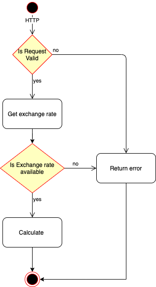
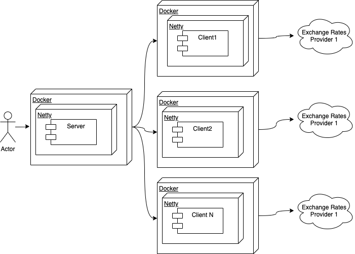

## Currency Exchange

## Introduction
Currency Exchange exposes Reactive RESTful endpoint that handles currency exchange operation.
It uses external providers to obtain exchange rate and perform required calculations.

[Requirements](https://docsend.com/view/6rphu2z)

Exchange flow



##Components
- server - accepts requests for currency exchanges, retrieve exchange rate from clients, perform calculations and return the data
- client1..n - a separate web application that is responsible to retrieve exchange rates from external providers




### Build
```shell
$ make build
```

Builds project inside Docker containers using [multi-stage builds](https://docs.docker.com/develop/develop-images/multistage-build/)

Result of the build is 3 docker images:

```shell
kekslv/currency/server
kekslv/currency/client1
kekslv/currency/client2
```

### Run
```shell
$ make up
```
Starts "server" and "clients" containers. The server will be listening at 8080 port.
### Stop
```shell
$ make down
```
Stops all containers

### Test with Swagger UI
The project provides Swagger UI for REST API calls: http://localhost:8080/swagger-ui.html


